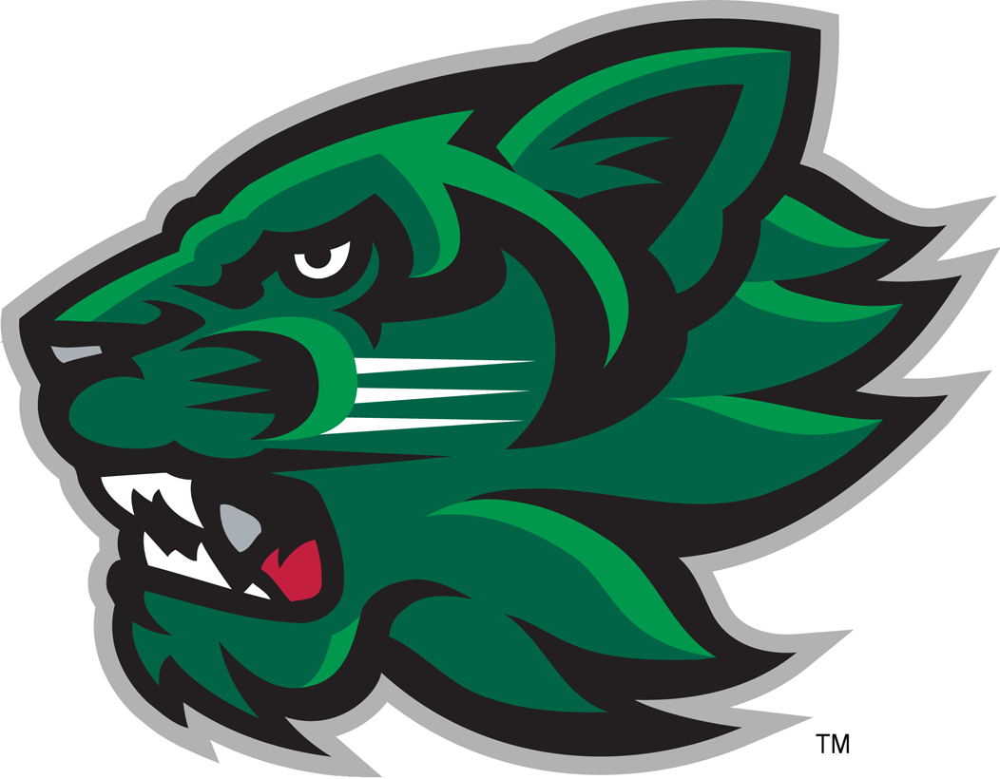
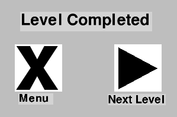
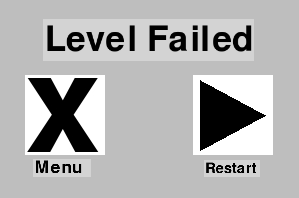
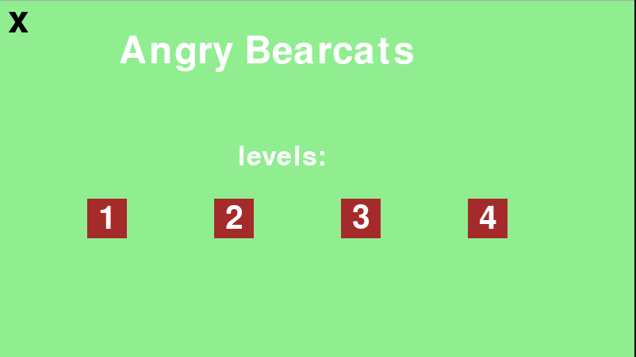

:warning: Everything between << >> needs to be replaced (remove << >> after replacing)
# CS110 Project Proposal
# Angry Bearcats
## CS 110 Final Project
### Fall, 2022
### [Assignment Description](https://docs.google.com/document/d/1H4R6yLL7som1lglyXWZ04RvTp_RvRFCCBn6sqv-82ps/edit?usp=sharing)

https://replit.com/join/rwduvsnqcx-justintunney

https://docs.google.com/presentation/d/1JcHTbn3g1zTsNo90AQOf9HAuV7O3hy7w7m0mw8DSZPw/edit?usp=sharing

### Team: Justin & Fatime
#### Justin Tunney & Fatime Useini

***

## Project Description

Project Overview:
The user is in control of a launcher that they can move vertically using the up and down keys. They must allign the launcher to hit enemy sprites moving towards them. The main objective is to destroy the enemies before they surpass the launcher on screen. 
***    

## User Interface Design

- **Initial Concept**

Level Select: The first screen will showcase buttons with the level numbers. It will detect a mouse click to initiate the game screen for the that level.

Game Screen: Our initial design was a recreation of angry birds where the user was could drag the character to aim it at the enemies on the opposite side of the screen.

Pause Screen: The game screen will have a pause button that initiates the pause screen when clicked. The pause screen will provide the option to resume play or go back to the level screen. 

Complete Game Screen: This screen will conclude each level displaying a different message depending on whether the user completed the level or not. It will also offer a button to replay or go to the next level.
    
- **Final GUI**

***        

## Program Design

* Non-Standard libraries
      
* Class Interface Design
    * << A simple drawing that shows the class relationships in your code (see below for an example). This does not need to be overly detailed, but should show how your code fits into the Model/View/Controller paradigm. >>
        *  
* Classes

Class Name:
Character
Instance Variables:
x: sprites x position
y: sprites y position
Methods:
update: updates character x values and removes sprite when it goes off screen

Class Name:
Enemy 
Instance Variables:
speed: the speed at which the sprite moves
Methods: 
update: updates enemy x values to decrease by its speed
position_x: returns the current x position of enemy

Class Name:
Launcher
Instance Variables:
x: sprites x position
y: sprites y position 
Methods:
update: increases and decreases the y position of the launcher using the up and down key
draw_new_character: returns an x and y position for a new character using the current position of launcher 

Class Name:
Screens
Instance Variables:
None
Methods:
Update_menu: show screen for the main menu
Update_game: make and show game_screen for each level
game_won: if level is completed show pop up for game completed
game_lost: if level is failed show pop up for level failed

Class Name:
Controller
Instance Variables:
screen: demensions and creation of pygame window
Methods:
mainloop: main loop of function that starts program and runs main menu
gameloop: loop that controls game screen
gameoverloop: loop for buttons after level is completed or failed

## Project Structure and File List

The Project is broken down into the following file structure:

* main.py
* src
    
    
    
    
    
    
  
* assets
    
    
    
    
    
    
    
    
    
    
    
* etc
    
    
    
    
    
    
    
    
    
    
    
    
    

***

## Tasks and Responsibilities 
Justin was responsible for creating the controller class and screens class. We collaborated on character, enemy, launcher and creating levels. 

## Testing

* For testing this project we would simply run the main program and if an error in the code came up we would find the line and try to correct it. If the program worked but not as intended we would investigate the problem and fix it and if the program was running very slow we would look for places to improve efficency of code. 

## ATP

| Step                 |Procedure             |Expected Results                   |
|----------------------|:--------------------:|----------------------------------:|
|  1                   | Run  Program         |GUI window appears menu            |
|  2                   | click level button   | display changes to level selected |
|  3                   | Run  game            |GUI window appears game            |
|  4                   | game ends and pop up | display changes to gameover screen|
|  5                   | leave game,repeat level, or continue | display option    |
|  6                   | previous steps depending on user | display changes to screen|
